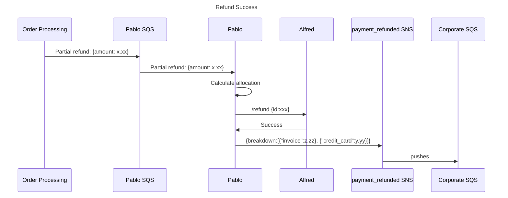
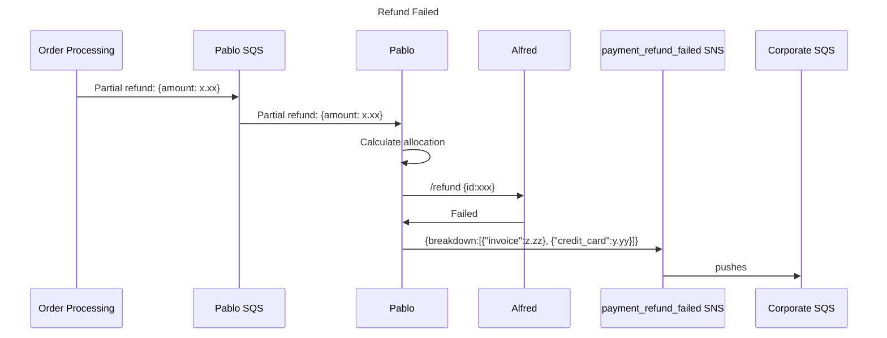
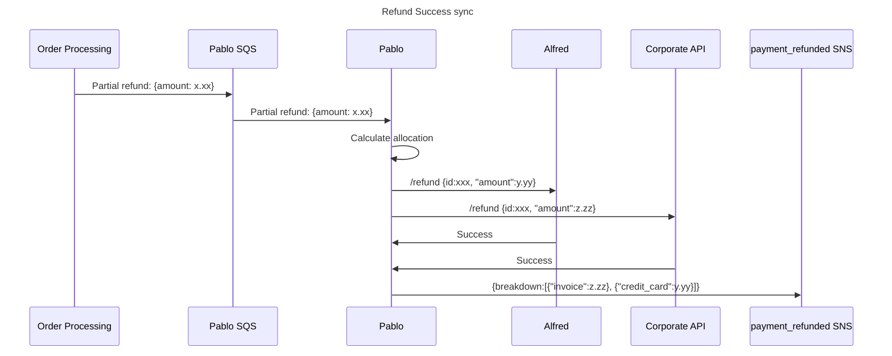

```mermaid
---
title: Refund Success
---
sequenceDiagram
    Order Processing->>Pablo SQS: Partial refund: {amount: x.xx}
    Pablo SQS->>Pablo: Partial refund: {amount: x.xx}
    Pablo->>Pablo: Calculate allocation
    Pablo->>Alfred: /refund {id:xxx}
    Alfred->>Pablo: Success
    Pablo->>payment_refunded SNS: {breakdown:[{"invoice":z.zz}, {"credit_card":y.yy}]}
    payment_refunded SNS->>Corporate SQS: pushes
```

```mermaid
---
title: Refund Failed
---
sequenceDiagram
    Order Processing->>Pablo SQS: Partial refund: {amount: x.xx}
    Pablo SQS->>Pablo: Partial refund: {amount: x.xx}
    Pablo->>Pablo: Calculate allocation
    Pablo->>Alfred: /refund {id:xxx}
    Alfred->>Pablo: Failed
    Pablo->>payment_refund_failed SNS: {breakdown:[{"invoice":z.zz}, {"credit_card":y.yy}]}
    payment_refund_failed SNS->>Corporate SQS: pushes
```

```mermaid
---
title: Refund Success sync
---
sequenceDiagram
    Order Processing->>Pablo SQS: Partial refund: {amount: x.xx}
    Pablo SQS->>Pablo: Partial refund: {amount: x.xx}
    Pablo->>Pablo: Calculate allocation
    Pablo->>Alfred: /refund {id:xxx, "amount":y.yy}
    Pablo->>Corporate API: /refund {id:xxx, "amount":z.zz}
    Alfred->>Pablo: Success
    Corporate API->>Pablo: Success
    Pablo->>payment_refunded SNS: {breakdown:[{"invoice":z.zz}, {"credit_card":y.yy}]}
```
